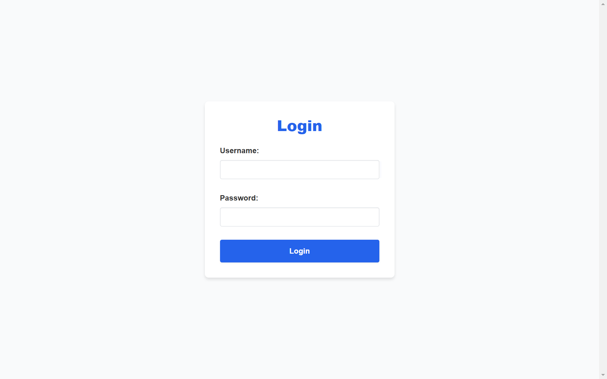
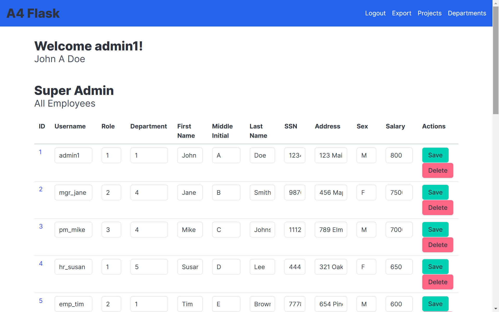
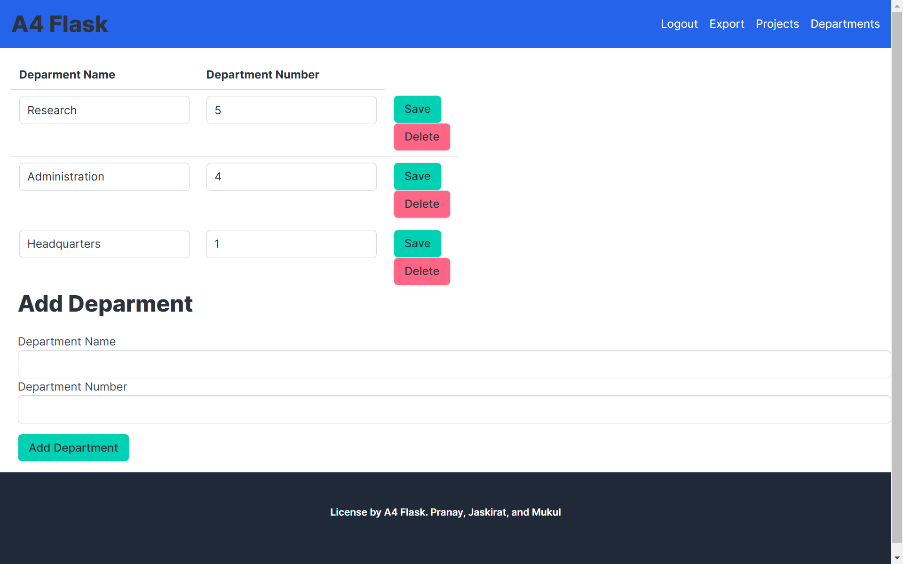
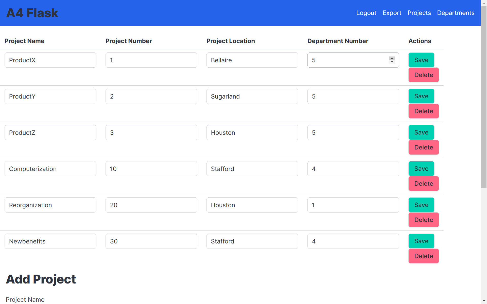
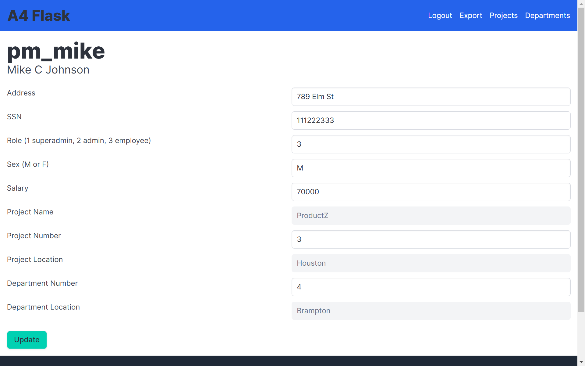
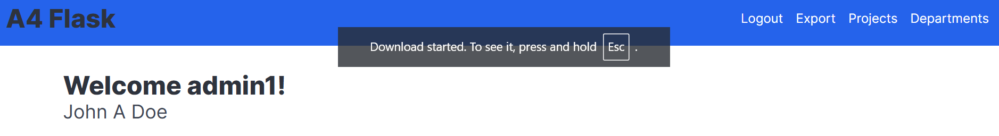
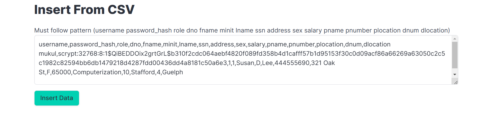
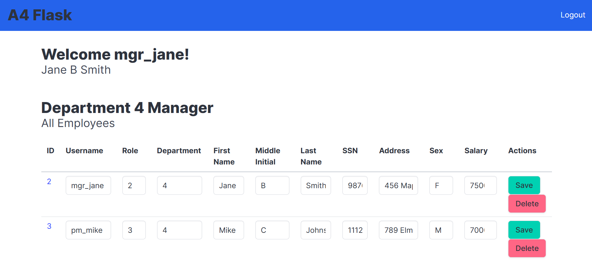
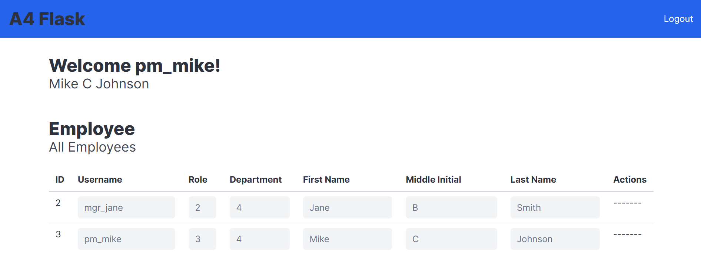

# Class Project: Flask Application

This project was developed as part of a class assignment. The objective was to create a web application using the following technologies:

## Tech Stack

- **Python**
- **Flask**
- **PostgreSQL**

## Description

This application highlights the robust capabilities of Flask as a web framework and PostgreSQL as a database management system. It serves as a comprehensive front-end for a Companies Database, integrating various features designed to enhance data management and user interaction.

### Key Features

- **User Authentication**: Secure login and registration system to manage access.
  
  

- **Companies Database**: Manage comprehensive data, including:

-   **Employees**

    
    
  - **Departments**

    

  - **Company Projects**

       

  - **Employee Profiles**

      

  - **Export Data to Excel**

    

  - **Import CSV Files**

    

### Role-Based Access Control (RBAC)

The application implements a Role-Based Access Control (RBAC) model, ensuring secure and structured access:

- **Super Admin**: Full CRUD capabilities across all modules.
  
  

- **Department Manager**: CRUD capabilities are restricted to their department. (notice header compared to Super Admin)
  
    
  *Add a screenshot showcasing a Department Manager's restricted access.*

- **Employee User**: Read-only access within their department.
  
    

This structured approach ensures that users have access to only the data and functionalities relevant to their roles, promoting data security and operational efficiency.

## Setup Instructions

1. Clone the repository.

2. Create a virtual environment and activate it.

3. Install the required dependencies using `pip install flask pip install psycopg2`.

4. Set up the PostgreSQL database and update the configuration in the application.  

5. Run the application using `python3 app.py`.  

## Live Demo

## Live Demo

I will host the application for everyone to use as soon as finals week finishes, stay tuned.

## License

This project is licensed under the MIT License.

## Acknowledgements

Special thanks to the course instructors and teaching assistants for their guidance and support.
